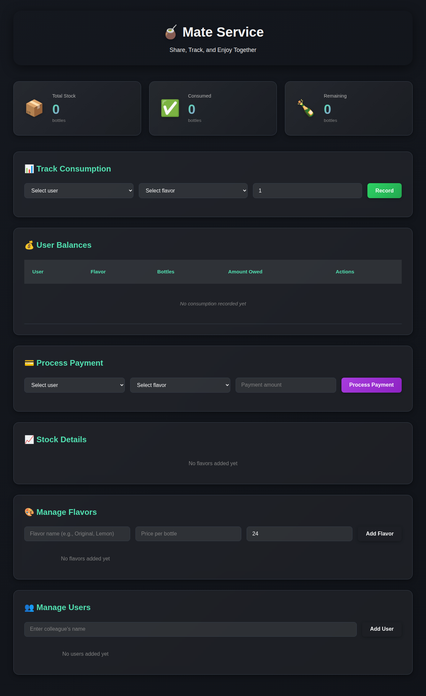
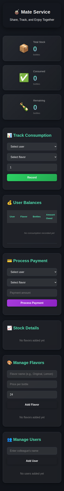

# Inventory Service 📦

A simple, customizable inventory management system for tracking shared items among colleagues. Perfect for office drinks, snacks, or any shared consumables.

## Screenshots

### Desktop


### Mobile


## Features

- 📦 **Stock Management** - Track inventory levels for multiple items
- 👥 **User Management** - Add and manage users who consume items
- 📊 **Consumption Tracking** - Record who takes what
- 💳 **Payment Processing** - Track payments and balances
- 💰 **Balance Overview** - See who owes what at a glance
- 📱 **Responsive Design** - Works on desktop and mobile
- 🎨 **Fully Customizable** - Adapt for any product type via config

## Quick Start

1. Install dependencies:
   ```bash
   npm install
   ```

2. Start the server:
   ```bash
   node server.js
   ```

3. Open `http://localhost:3000` in your browser

## Customization

The app is designed to be easily customizable for different use cases. Edit `config.js` to adapt it:

### Example: Mate Drinks
```javascript
const CONFIG = {
    appName: "Mate Service",
    appSubtitle: "Share, Track, and Enjoy Together",
    appEmoji: "🧉",
    terminology: {
        item: "Flavor",
        items: "Flavors",
        unit: "bottle",
        units: "bottles"
    },
    emojis: {
        remaining: "🧉",
        lowStock: "🧉"
    },
    placeholders: {
        itemName: "Flavor name (e.g., Original, Lemon)"
    }
};
```

### Example: Snacks/Chips
```javascript
const CONFIG = {
    appName: "Snack Tracker",
    appSubtitle: "Track Office Munchies",
    appEmoji: "🍿",
    terminology: {
        item: "Snack",
        items: "Snacks",
        unit: "bag",
        units: "bags"
    },
    emojis: {
        remaining: "🍿",
        lowStock: "🍿"
    },
    placeholders: {
        itemName: "Snack name (e.g., Doritos, Lays)"
    }
};
```

### Example: Coffee
```javascript
const CONFIG = {
    appName: "Coffee Club",
    appSubtitle: "Fuel Your Day Together",
    appEmoji: "☕",
    terminology: {
        item: "Coffee",
        items: "Coffees",
        unit: "cup",
        units: "cups"
    },
    emojis: {
        remaining: "☕",
        lowStock: "☕"
    },
    placeholders: {
        itemName: "Coffee type (e.g., Espresso, Latte)"
    }
};
```

## Configuration Options

| Option | Description |
|--------|-------------|
| `appName` | Name shown in the header |
| `appSubtitle` | Subtitle text |
| `appEmoji` | Main emoji for the app |
| `terminology.item/items` | Singular/plural for your item type |
| `terminology.unit/units` | Singular/plural for units (bottle, bag, piece, etc.) |
| `emojis.*` | Various emojis used throughout the UI |
| `defaults.initialStock` | Default stock when adding new items |
| `defaults.lowStockThreshold` | When to show visual low-stock warnings |
| `defaults.currency` | Currency symbol |
| `defaults.currencyPosition` | "before" or "after" |
| `labels.*` | Section heading labels |
| `placeholders.*` | Placeholder text for input fields |

## Data Storage

Data is stored in `inventory_data.json` in the project root. The file is automatically created and updated.

## Network Access

The server binds to `0.0.0.0`, making it accessible from other devices on your network. Check the console output for available network addresses.

## Running on Windows

Double-click `start_server.bat` to automatically install dependencies and start the server.

## Tech Stack

- **Frontend**: Vanilla HTML, CSS, JavaScript
- **Backend**: Node.js with Express
- **Storage**: JSON file

## License

ISC
