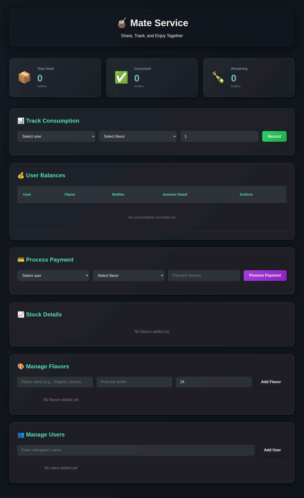
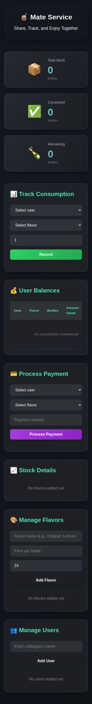

# Mate Service 🧉

A simple, customizable inventory management system for tracking shared items among colleagues. Perfect for office drinks, snacks, or any shared consumables.

## Screenshots

### Desktop


### Mobile


## Features

- 📦 **Stock Management** - Track inventory levels for multiple items
- 👥 **User Management** - Add and manage users who consume items
- 📊 **Consumption Tracking** - Record who takes what
- 💳 **Payment Processing** - Track payments and balances
- 💰 **Balance Overview** - See who owes what at a glance
- 📱 **Responsive Design** - Works on desktop and mobile
- 🎨 **Fully Customizable** - Adapt for any product type via config
- 💾 **Persistent Storage** - Data survives restarts

---

## 🚀 Deployment Options

Choose the deployment method that works best for your setup:

| Option | Best For | Requirements |
|--------|----------|--------------|
| [**Option 1: Local Server**](#option-1-local-server-nodejs) | Quick setup, PC always on | Node.js, Computer/Raspberry Pi |
| [**Option 2: ESP32-C3**](#option-2-esp32-c3-standalone) | Standalone, low-power, always-on | ESP32-C3 board, WiFi |

---

## Option 1: Local Server (Node.js)

Run the server on your computer, Raspberry Pi, or any device with Node.js. Simple and quick to set up.

### Requirements

- [Node.js](https://nodejs.org/) (v14 or higher)
- Any OS (Windows, macOS, Linux)

### Quick Start

1. **Clone the repository:**
   ```bash
   git clone https://github.com/yourusername/mate_service.git
   cd mate_service
   ```

2. **Install dependencies:**
   ```bash
   npm install
   ```

3. **Start the server:**
   ```bash
   node server.js
   ```

4. **Open in browser:**
   ```
   http://localhost:3000
   ```

### Windows Users

Double-click `start_server.bat` to automatically install dependencies and start the server.

### Network Access

The server binds to `0.0.0.0`, making it accessible from other devices on your network. Check the console output for available network addresses:

```
Server running at:
  - Local:   http://localhost:3000
  - Network: http://192.168.1.100:3000
```

### Data Storage

Data is stored in `inventory_data.json` in the project root. The file is automatically created and updated.

---

## Option 2: ESP32-C3 (Standalone)

Deploy as a standalone device using an ESP32-C3 microcontroller. The ESP32 hosts the entire website and connects to your WiFi network. No external server needed!

### Advantages

- ✅ **Always On** - Low power consumption (~0.5W)
- ✅ **No PC Required** - Runs independently
- ✅ **Portable** - Small form factor
- ✅ **mDNS Support** - Access via `http://mate-tracker.local`
- ✅ **Persistent Storage** - Data survives power cycles

### Requirements

- ESP32-C3 development board (e.g., ESP32-C3-DevKitM-1, ~$5-10)
- USB cable for programming
- WiFi network (2.4GHz)
- [PlatformIO](https://platformio.org/) (VS Code extension or CLI)

### Quick Start

1. **Navigate to firmware folder:**
   ```bash
   cd esp32_firmware
   ```

2. **Configure WiFi credentials** in `src/config.h`:
   ```cpp
   #define WIFI_SSID     "YourWiFiName"
   #define WIFI_PASSWORD "YourWiFiPassword"
   ```

3. **Build and upload:**
   ```bash
   # macOS/Linux
   ./build.sh all

   # Windows
   build.bat all

   # Or using PlatformIO directly
   pio run --target uploadfs   # Upload web files
   pio run --target upload     # Upload firmware
   ```

4. **Monitor serial output:**
   ```bash
   pio device monitor
   ```

5. **Access the website** at the IP shown in serial output or:
   ```
   http://mate-tracker.local
   ```

### Detailed Documentation

See [esp32_firmware/README.md](esp32_firmware/README.md) for complete ESP32 documentation including:
- Hardware setup
- API endpoints
- Troubleshooting
- LED indicators
- Configuration options

---

## 🎨 Customization

The app is designed to be easily customizable for different use cases. Edit `config.js` to adapt it:

### Example: Mate Drinks (Default)
```javascript
const CONFIG = {
    appName: "Mate Service",
    appSubtitle: "Share, Track, and Enjoy Together",
    appEmoji: "🧉",
    terminology: {
        item: "Flavor",
        items: "Flavors",
        unit: "bottle",
        units: "bottles"
    },
    emojis: {
        remaining: "🧉",
        lowStock: "🧉"
    }
};
```

### Example: Snacks/Chips
```javascript
const CONFIG = {
    appName: "Snack Tracker",
    appSubtitle: "Track Office Munchies",
    appEmoji: "🍿",
    terminology: {
        item: "Snack",
        items: "Snacks",
        unit: "bag",
        units: "bags"
    }
};
```

### Example: Coffee
```javascript
const CONFIG = {
    appName: "Coffee Club",
    appSubtitle: "Fuel Your Day Together",
    appEmoji: "☕",
    terminology: {
        item: "Coffee",
        items: "Coffees",
        unit: "cup",
        units: "cups"
    }
};
```

### Configuration Options

| Option | Description |
|--------|-------------|
| `appName` | Name shown in the header |
| `appSubtitle` | Subtitle text |
| `appEmoji` | Main emoji for the app |
| `terminology.item/items` | Singular/plural for your item type |
| `terminology.unit/units` | Singular/plural for units (bottle, bag, piece, etc.) |
| `emojis.*` | Various emojis used throughout the UI |
| `defaults.initialStock` | Default stock when adding new items |
| `defaults.lowStockThreshold` | When to show visual low-stock warnings |
| `defaults.currency` | Currency symbol |
| `defaults.currencyPosition` | "before" (€10) or "after" (10€) |
| `labels.*` | Section heading labels |
| `placeholders.*` | Placeholder text for input fields |
| `paymentLink` | External payment URL (e.g., PayPal.me link). When set, the **Pay Now** button opens this link in a new tab in addition to pre-filling the built-in payment form. Leave empty (`""`) to use only the built-in form. |

> **Note for ESP32:** After modifying `config.js`, also update `esp32_firmware/data/config.js` and re-upload the filesystem.

---

## 📁 Project Structure

```
mate_service/
├── README.md                 # This file
├── index.html                # Main webpage
├── style.css                 # Styles
├── app.js                    # Frontend JavaScript
├── config.js                 # App configuration
├── server.js                 # Node.js server
├── package.json              # Node.js dependencies
├── start_server.bat          # Windows quick start
├── inventory_data.json       # Data storage (auto-created)
├── screenshots/              # App screenshots
└── esp32_firmware/           # ESP32-C3 firmware
    ├── README.md             # ESP32 documentation
    ├── platformio.ini        # PlatformIO config
    ├── build.sh              # Build script (macOS/Linux)
    ├── build.bat             # Build script (Windows)
    ├── src/                  # Firmware source code
    │   ├── main.cpp
    │   ├── config.h          # WiFi credentials
    │   ├── wifi_manager.h
    │   ├── web_handlers.h
    │   └── data_storage.h
    └── data/                 # Web files for ESP32 (optimized)
        ├── index.html
        ├── style.css
        ├── config.js
        └── app.js
```

---

## 🔌 API Endpoints

Both deployment options expose the same REST API:

| Method | Endpoint | Description |
|--------|----------|-------------|
| GET | `/api/state` | Get full application state |
| POST | `/api/users` | Add new user |
| DELETE | `/api/users/:id` | Remove user |
| POST | `/api/items` | Add new item |
| DELETE | `/api/items/:id` | Remove item |
| PUT | `/api/items/:id/stock` | Update item stock |
| POST | `/api/consumption` | Record consumption |
| POST | `/api/payments` | Process payment |

**ESP32 only:**

| Method | Endpoint | Description |
|--------|----------|-------------|
| GET | `/api/status` | Device status (WiFi, memory, uptime) |
| POST | `/api/reset` | Reset all data |

---

## Tech Stack

### Node.js Server
- **Frontend**: Vanilla HTML, CSS, JavaScript
- **Backend**: Node.js with Express
- **Storage**: JSON file

### ESP32-C3 Firmware
- **Framework**: Arduino (PlatformIO)
- **Web Server**: ESPAsyncWebServer
- **Filesystem**: LittleFS
- **Storage**: NVS (Non-Volatile Storage)

---

## License

ISC
